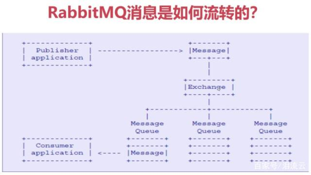

1.1、什么是RabbitMQ？
（文章来源:转载自：https://baijiahao.baidu.com/s?id=1626711091319890175&wfr=spider&for=pc）
RabbitMQ是一个开元的消息代理和队列服务器，用来通过普通协议在完全不同的应用之间共享数据，RabbitMQ是使用Erlang语言来编写的，并且RabbitMQ是基于 AMQP协议的。

1.2、RabbitMQ有哪些特点？

目前大多数互联网都在使用RabbitMQ

RabbitMQ底层采用Erlang语言进行编写

开源、性能优秀，稳定

与SpringAMQP完美的整合、API丰富

集群模式丰富，表达式配置，HA模式，镜像队列模型

保证数据不丢失的前提做到高可靠、可用性

1.3、AMQP协议模型

2、RabbitMQ安装和使用

官方下载地址：http://www.rabbitmq.com/

具体安装步骤教程自行百度，安装完后，访问如下地址表示安装成功

3、RabbitMQ核心概念

Server：又称Broker（实体服务） 接收客户端的连接。实现AMQP实体服务

Connection：连接，应用程序与Broker的网络连接

Channel ：网络信道，几乎所有的操作都在Chanel中进行，Channel是进行消息读写的通道。客户端可建立多个Channel，每个Channel代表一个

会话任务

Message：消息，服务器和应用程序之间传送的数据，由Properties和Body组成。Properties可以对消息进行修饰，比如消息的优先级，延迟等高级特性；Body则就是消息体内容。

Virtual host：虚拟地址，用于进行逻辑隔离，最上层的消息路由。一个

Virtual host里面可以有若干个Exchange和Queue，同一个Virtual host里面不能有相同名称的Exchange或Queue（用于隔离不同的项目和应用的）

Exchange：交换机，接收消息，根据路由键转发消息到绑定的队列

Binding：Exchange和Queue之间的虚拟连接，binding中可以包含routing key

Routing key：一个路由规则，虚拟机可用它来确定如何路由一个特定消息

Queue：也称为Message Queue,消息队列，保存消息并将它们转发给消费者，消费者直接监听队列就能收到消息了

二、RabbitMQ整合Spring Boot2.x

1、生产端基本配置application.properties

   spring.rabbitmq.addresses=localhost:5672spring.rabbitmq.username=guestspring.rabbitmq.password=guestspring.rabbitmq.virtual-host=/spring.rabbitmq.connection-timeout=15000server.servlet.context-path=/server.port=8001spring.http.encoding.charset=UTF-8spring.jackson.date-format=yyyy-MM-dd HH:mm:ssspring.jackson.time-zone=GMT+8spring.jackson.default-property-inclusion=NON_NULL

2、生产端发送消息

3、配置rabbitmq的exchange和queue，并让二者建立关联关系

4、消息发送成功

5、消费端配置application.properties

#springboot整合rabbitmq基本配置spring.rabbitmq.addresses=localhost:5672spring.rabbitmq.username=guestspring.rabbitmq.password=guestspring.rabbitmq.virtual-host=/spring.rabbitmq.connection-timeout=15000#springboot整合rabbitmq消费端配置spring.rabbitmq.listener.simple.concurrency=5spring.rabbitmq.listener.simple.acknowledge-mode=manualspring.rabbitmq.listener.simple.max-concurrency=10#限流spring.rabbitmq.listener.simple.prefetch=1server.servlet.context-path=/server.port=8002spring.http.encoding.charset=UTF-8spring.jackson.date-format=yyyy-MM-dd HH:mm:ssspring.jackson.time-zone=GMT+8spring.jackson.default-property-inclusion=NON_NULL

5、消费端代码编写

三、消息100%可靠性投递的解决方案实现

Step 1： 首先把消息信息(业务数据）存储到数据库中，紧接着，我们再把这个消息记录也存储到一张消息记录表里（或者另外一个同源数据库的消息记录表）

Step 2：发送消息到MQ Broker节点（采用confirm方式发送，会有异步的返回结果）

Step 3、4：生产者端接受MQ Broker节点返回的Confirm确认消息结果，然后进行更新消息记录表里的消息状态。比如默认Status = 0 当收到消息确认成功后，更新为1即可！

Step 5：但是在消息确认这个过程中可能由于网络闪断、MQ Broker端异常等原因导致 回送消息失败或者异常。这个时候就需要发送方（生产者）对消息进行可靠性投递了，保障消息不丢失，100%的投递成功！（有一种极限情况是闪断，Broker返回的成功确认消息，但是生产端由于网络闪断没收到，这个时候重新投递可能会造成消息重复，需要消费端去做幂等处理）所以我们需要有一个定时任务，（比如每5分钟拉取一下处于中间状态的消息，当然这个消息可以设置一个超时时间，比如超过1分钟 Status = 0 ，也就说明了1分钟这个时间窗口内，我们的消息没有被确认，那么会被定时任务拉取出来）

Step 6：接下来我们把中间状态的消息进行重新投递 retry send，继续发送消息到MQ ，当然也可能有多种原因导致发送失败

Step 7：我们可以采用设置最大努力尝试次数，比如投递了3次，还是失败，那么我们可以将最终状态设置为Status = 2 ，最后 交由人工解决处理此类问题（或者把消息转储到失败表中）。