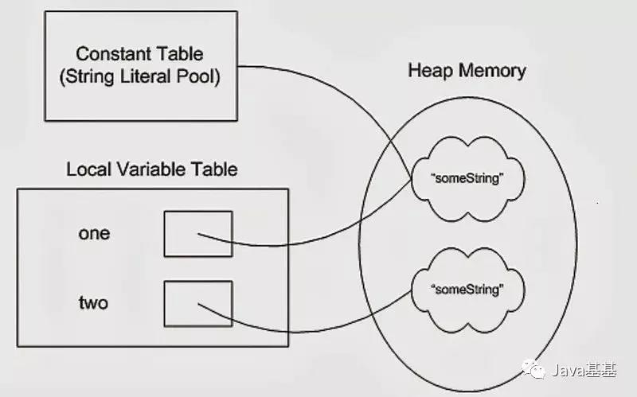
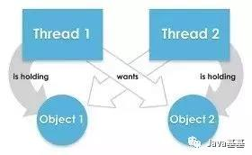

+ 1.为什么等待和通知是在 Object 类而不是 Thread 中声明的？
+ 2.为什么Java中不支持多重继承？
+ 3.为什么Java不支持运算符重载？
+ 4.为什么 String 在 Java 中是不可变的？
+ 5.为什么 char 数组比 Java 中的 String 更适合存储密码？
+ 6.如何使用双重检查锁定在 Java 中创建线程安全的单例？
+ 7编写 Java 程序时, 如何在 Java 中创建死锁并修复它？
+ 8如果你的Serializable类包含一个不可序列化的成员，会发生什么？你是如何解决的？
+ 9 为什么Java中 wait 方法需要在 synchronized 的方法中调用？
+ 10.你能用Java覆盖静态方法吗？如果我在子类中创建相同的方法是编译时错误？
这是我收集的10个最棘手的Java面试问题列表。这些问题主要来自 Java 核心部分 ,不涉及 Java EE 相关问题。你可能知道这些棘手的 Java 问题的答案，或者觉得这些不足以挑战你的 Java 知识，但这些问题都是容易在各种 Java 面试中被问到的，而且包括我的朋友和同事在内的许多程序员都觉得很难回答。

>1.为什么等待和通知是在 Object 类而不是 Thread 中声明的？

>一个棘手的 Java 问题，如果 Java编程语言不是你设计的，你怎么能回答这个问题呢。Java编程的常识和深入了解有助于回答这种棘手的 Java 核心方面的面试问题。

> 为什么 wait，notify 和 notifyAll 是在 Object 类中定义的而不是在 Thread 类中定义

            `这是有名的 Java 面试问题，招2~4年经验的到高级 Java 开发人员面试都可能碰到。

            这个问题的好在它能反映了面试者对等待通知机制的了解, 以及他对此主题的理解是否明确。就像为什么 Java 中不支持多继承或者为什么 String 在 Java 中是 final 的问题一样，这个问题也可能有多个答案。

            为什么在 Object 类中定义 wait 和 notify 方法，每个人都能说出一些理由。从我的面试经验来看, wait 和 nofity 仍然是大多数Java 程序员最困惑的，特别是2到3年的开发人员，如果他们要求使用 wait 和 notify, 他们会很困惑。因此，如果你去参加 Java 面试，请确保对 wait 和 notify 机制有充分的了解，并且可以轻松地使用 wait 来编写代码，并通过生产者-消费者问题或实现阻塞队列等了解通知的机制。

            为什么等待和通知需要从同步块或方法中调用, 以及 Java 中的 wait，sleep 和 yield 方法之间的差异，如果你还没有读过，你会觉得有趣。为何 wait，notify 和 notifyAll 属于 Object 类? 为什么它们不应该在 Thread 类中? 以下是我认为有意义的一些想法：
`
1) wait 和 notify 不仅仅是普通方法或同步工具，更重要的是它们是 Java 中两个线程之间的通信机制。对语言设计者而言, 如果不能通过 Java 关键字(例如 synchronized)实现通信此机制，同时又要确保这个机制对每个对象可用, 那么 Object 类则是的正确声明位置。记住同步和等待通知是两个不同的领域，不要把它们看成是相同的或相关的。同步是提供互斥并确保 Java 类的线程安全，而 wait 和 notify 是两个线程之间的通信机制。

2) 每个对象都可上锁，这是在 Object 类而不是 Thread 类中声明 wait 和 notify 的另一个原因。

3) 在 Java 中为了进入代码的临界区，线程需要锁定并等待锁定，他们不知道哪些线程持有锁，而只是知道锁被某个线程持有， 并且他们应该等待取得锁, 而不是去了解哪个线程在同步块内，并请求它们释放锁定。

4) Java 是基于 Hoare 的监视器的思想。在Java中，所有对象都有一个监视器。

线程在监视器上等待，为执行等待，我们需要2个参数：

一个线程
一个监视器(任何对象)
在 Java 设计中，线程不能被指定，它总是运行当前代码的线程。但是，我们可以指定监视器(这是我们称之为等待的对象)。这是一个很好的设计，因为如果我们可以让任何其他线程在所需的监视器上等待，这将导致“入侵”，导致在设计并发程序时会遇到困难。请记住，在 Java 中，所有在另一个线程的执行中侵入的操作都被弃用了(例如 stop 方法)。

2.为什么Java中不支持多重继承？

我发现这个 Java 核心问题很难回答，因为你的答案可能不会让面试官满意，在大多数情况下，面试官正在寻找答案中的关键点，如果你提到这些关键点，面试官会很高兴。在 Java 中回答这种棘手问题的关键是准备好相关主题, 以应对后续的各种可能的问题。

这是非常经典的问题，与为什么 String 在 Java 中是不可变的很类似; 这两个问题之间的相似之处在于它们主要是由 Java 创作者的设计决策使然。

为什么Java不支持多重继承, 可以考虑以下两点:

1)第一个原因是围绕钻石形继承问题产生的歧义，考虑一个类 A 有 foo() 方法, 然后 B 和 C 派生自 A, 并且有自己的 foo() 实现，现在 D 类使用多个继承派生自 B 和C，如果我们只引用 foo(), 编译器将无法决定它应该调用哪个 foo()。这也称为 Diamond 问题，因为这个继承方案的结构类似于菱形，见下图:

                            A foo()
                        / \
                        /     \
            foo() B     C foo()
                        \     /
                        \ /
                        D  foo()
即使我们删除钻石的顶部 A 类并允许多重继承，我们也将看到这个问题含糊性的一面。如果你把这个理由告诉面试官，他会问为什么 C++ 可以支持多重继承而 Java不行。嗯，在这种情况下，我会试着向他解释我下面给出的第二个原因，它不是因为技术难度, 而是更多的可维护和更清晰的设计是驱动因素, 虽然这只能由 Java 言语设计师确认，我们只是推测。维基百科链接有一些很好的解释，说明在使用多重继承时，由于钻石问题，不同的语言地址问题是如何产生的。

2)对我来说第二个也是更有说服力的理由是，多重继承确实使设计复杂化并在转换、构造函数链接等过程中产生问题。假设你需要多重继承的情况并不多，简单起见，明智的决定是省略它。此外，Java 可以通过使用接口支持单继承来避免这种歧义。由于接口只有方法声明而且没有提供任何实现，因此只有一个特定方法的实现，因此不会有任何歧义。（实用详尽的Java面试题大全，可以在Java知音公众号回复“面试题聚合”）

3.为什么Java不支持运算符重载？

另一个类似棘手的Java问题。为什么 C++ 支持运算符重载而 Java 不支持? 有人可能会说+运算符在 Java 中已被重载用于字符串连接，不要被这些论据所欺骗。

与 C++ 不同，Java 不支持运算符重载。Java 不能为程序员提供自由的标准算术运算符重载，例如+， - ，*和/等。如果你以前用过 C++，那么 Java 与 C++ 相比少了很多功能，例如 Java 不支持多重继承，Java中没有指针，Java中没有引用传递。另一个类似的问题是关于 Java 通过引用传递，这主要表现为 Java 是通过值还是引用传参。虽然我不知道背后的真正原因，但我认为以下说法有些道理，为什么 Java 不支持运算符重载。

1)简单性和清晰性。清晰性是Java设计者的目标之一。设计者不是只想复制语言，而是希望拥有一种清晰，真正面向对象的语言。添加运算符重载比没有它肯定会使设计更复杂，并且它可能导致更复杂的编译器, 或减慢 JVM，因为它需要做额外的工作来识别运算符的实际含义，并减少优化的机会, 以保证 Java 中运算符的行为。

2)避免编程错误。Java 不允许用户定义的运算符重载，因为如果允许程序员进行运算符重载，将为同一运算符赋予多种含义，这将使任何开发人员的学习曲线变得陡峭，事情变得更加混乱。据观察，当语言支持运算符重载时，编程错误会增加，从而增加了开发和交付时间。由于 Java 和 JVM 已经承担了大多数开发人员的责任，如在通过提供垃圾收集器进行内存管理时，因为这个功能增加污染代码的机会, 成为编程错误之源, 因此没有多大意义。

3)JVM复杂性。从JVM的角度来看，支持运算符重载使问题变得更加困难。通过更直观，更干净的方式使用方法重载也能实现同样的事情，因此不支持 Java 中的运算符重载是有意义的。与相对简单的 JVM 相比，复杂的 JVM 可能导致 JVM 更慢，并为保证在 Java 中运算符行为的确定性从而减少了优化代码的机会。

4)让开发工具处理更容易。这是在 Java 中不支持运算符重载的另一个好处。省略运算符重载使语言更容易处理，这反过来又更容易开发处理语言的工具，例如 IDE 或重构工具。Java 中的重构工具远胜于 C++。
*** 
###4.为什么 String 在 Java 中是不可变的？

我最喜欢的 Java 面试问题，很棘手，但同时也非常有用。一些面试者也常问这个问题，为什么 String 在 Java 中是 final 的。

字符串在 Java 中是不可变的，因为 String 对象缓存在 String 池中。由于缓存的字符串在多个客户之间共享，因此始终存在风险，其中一个客户的操作会影响所有其他客户。例如，如果一段代码将 String “Test” 的值更改为 “TEST”，则所有其他客户也将看到该值。由于 String 对象的缓存性能是很重要的一方面，因此通过使 String 类不可变来避免这种风险。

同时，String 是 final 的，因此没有人可以通过扩展和覆盖行为来破坏 String 类的不变性、缓存、散列值的计算等。String 类不可变的另一个原因可能是由于 HashMap。

由于把字符串作为 HashMap 键很受欢迎。对于键值来说，重要的是它们是不可变的，以便用它们检索存储在 HashMap 中的值对象。由于 HashMap 的工作原理是散列，因此需要具有相同的值才能正常运行。如果在插入后修改了 String 的内容，可变的 String将在插入和检索时生成两个不同的哈希码，可能会丢失 Map 中的值对象。

如果你是印度板球迷，你可能能够与我的下一句话联系起来。字符串是Java的 VVS Laxman，即非常特殊的类。我还没有看到一个没有使用 String 编写的 Java 程序。这就是为什么对 String 的充分理解对于 Java 开发人员来说非常重要。

String 作为数据类型，传输对象和中间人角色的重要性和流行性也使这个问题在 Java 面试中很常见。

为什么 String 在 Java 中是不可变的是 Java 中最常被问到的字符串访问问题之一，它首先讨论了什么是 String，Java 中的 String 如何与 C 和 C++ 中的 String 不同，然后转向在Java中什么是不可变对象，不可变对象有什么好处，为什么要使用它们以及应该使用哪些场景。

这个问题有时也会问：“为什么 String 在 Java 中是 final 的”。在类似的说明中，如果你正在准备Java 面试，我建议你看看《Java程序员面试宝典(第4版) 》，这是高级和中级Java程序员的优秀资源。它包含来自所有重要 Java 主题的问题，包括多线程，集合，GC，JVM内部以及 Spring和 Hibernate 框架等。

正如我所说，这个问题可能有很多可能的答案，而 String 类的唯一设计者可以放心地回答它。我在 Joshua Bloch 的 Effective Java 书中期待一些线索，但他也没有提到它。我认为以下几点解释了为什么 String 类在 Java 中是不可变的或 final 的：

1)想象字符串池没有使字符串不可变，它根本不可能，因为在字符串池的情况下，一个字符串对象/文字，例如 “Test” 已被许多参考变量引用，因此如果其中任何一个更改了值，其他参数将自动受到影响，即假设

String A="Test";
String B="Test";
现在字符串 B 调用 "Test".toUpperCase(), 将同一个对象改为“TEST”，所以 A 也是 “TEST”，这不是期望的结果。

下图显示了如何在堆内存和字符串池中创建字符串。

2)字符串已被广泛用作许多 Java 类的参数，例如，为了打开网络连接，你可以将主机名和端口号作为字符串传递，你可以将数据库 URL 作为字符串传递, 以打开数据库连接，你可以通过将文件名作为参数传递给 File I/O 类来打开 Java 中的任何文件。如果 String 不是不可变的，这将导致严重的安全威胁，我的意思是有人可以访问他有权授权的任何文件，然后可以故意或意外地更改文件名并获得对该文件的访问权限。由于不变性，你无需担心这种威胁。这个原因也说明了，为什么 String 在 Java 中是最终的，通过使 java.lang.String final，Java设计者确保没有人覆盖 String 类的任何行为。

3)由于 String 是不可变的，它可以安全地共享许多线程，这对于多线程编程非常重要. 并且避免了 Java 中的同步问题，不变性也使得String 实例在 Java 中是线程安全的，这意味着你不需要从外部同步 String 操作。关于 String 的另一个要点是由截取字符串 SubString 引起的内存泄漏，这不是与线程相关的问题，但也是需要注意的。

4)为什么 String 在 Java 中是不可变的另一个原因是允许 String 缓存其哈希码，Java 中的不可变 String 缓存其哈希码，并且不会在每次调用 String 的 hashcode 方法时重新计算，这使得它在 Java 中的 HashMap 中使用的 HashMap 键非常快。简而言之，因为 String 是不可变的，所以没有人可以在创建后更改其内容，这保证了 String 的 hashCode 在多次调用时是相同的。

5)String 不可变的绝对最重要的原因是它被类加载机制使用，因此具有深刻和基本的安全考虑。如果 String 是可变的，加载“java.io.Writer” 的请求可能已被更改为加载 “mil.vogoon.DiskErasingWriter”. 安全性和字符串池是使字符串不可变的主要原因。顺便说一句，上面的理由很好回答另一个Java面试问题: “为什么String在Java中是最终的”。要想是不可变的，你必须是最终的，这样你的子类不会破坏不变性。你怎么看？

5.为什么 char 数组比 Java 中的 String 更适合存储密码？

另一个基于 String 的棘手 Java 问题，相信我只有很少的 Java 程序员可以正确回答这个问题。这是一个真正艰难的核心Java面试问题，并且需要对 String 的扎实知识才能回答这个问题。

这是最近在 Java 面试中向我的一位朋友询问的问题。他正在接受技术主管职位的面试，并且有超过6年的经验。如果你还没有遇到过这种情况，那么字符数组和字符串可以用来存储文本数据，但是选择一个而不是另一个很难。但正如我的朋友所说，任何与 String 相关的问题都必须对字符串的特殊属性有一些线索，比如不变性，他用它来说服访提问的人。在这里，我们将探讨为什么你应该使用char[]存储密码而不是String的一些原因。

字符串：

1)由于字符串在 Java 中是不可变的，如果你将密码存储为纯文本，它将在内存中可用，直到垃圾收集器清除它. 并且为了可重用性，会存在 String 在字符串池中, 它很可能会保留在内存中持续很长时间，从而构成安全威胁。

由于任何有权访问内存转储的人都可以以明文形式找到密码，这是另一个原因，你应该始终使用加密密码而不是纯文本。由于字符串是不可变的，所以不能更改字符串的内容，因为任何更改都会产生新的字符串，而如果你使用char[]，你就可以将所有元素设置为空白或零。因此，在字符数组中存储密码可以明显降低窃取密码的安全风险。

2)Java 本身建议使用 JPasswordField 的 getPassword() 方法，该方法返回一个 char[] 和不推荐使用的getTex() 方法，该方法以明文形式返回密码，由于安全原因。应遵循 Java 团队的建议, 坚持标准而不是反对它。

3)使用 String 时，总是存在在日志文件或控制台中打印纯文本的风险，但如果使用 Array，则不会打印数组的内容而是打印其内存位置。虽然不是一个真正的原因，但仍然有道理。

            String strPassword =“Unknown”;
            char [] charPassword = new char [] {'U'，'n'，'k'，'w'，'o'，'n'};
            System.out.println(“字符密码：”+ strPassword);
            System.out.println(“字符密码：”+ charPassword);
        输出

        字符串密码：Unknown
        字符密码：[C @110b053
我还建议使用散列或加密的密码而不是纯文本，并在验证完成后立即从内存中清除它。因此,在Java中,用字符数组用存储密码比字符串是更好的选择。虽然仅使用char[]还不够，还你需要擦除内容才能更安全。（实用详尽的Java面试题大全，可以在Java知音公众号回复“面试题聚合”）

6.如何使用双重检查锁定在 Java 中创建线程安全的单例？

这个 Java 问题也常被问: 什么是线程安全的单例，你怎么创建它。好吧，在Java 5之前的版本, 使用双重检查锁定创建单例 Singleton 时，如果多个线程试图同时创建 Singleton 实例，则可能有多个 Singleton 实例被创建。从 Java 5 开始，使用 Enum 创建线程安全的Singleton很容易。但如果面试官坚持双重检查锁定，那么你必须为他们编写代码。记得使用volatile变量。

为什么枚举单例在 Java 中更好
枚举单例是使用一个实例在 Java 中实现单例模式的新方法。虽然Java中的单例模式存在很长时间,但枚举单例是相对较新的概念,在引入Enum作为关键字和功能之后,从Java5开始在实践中。本文与之前关于 Singleton 的内容有些相关, 其中讨论了有关 Singleton 模式的面试中的常见问题, 以及 10 个 Java 枚举示例, 其中我们看到了如何通用枚举可以。这篇文章是关于为什么我们应该使用Eeame作为Java中的单例,它比传统的单例方法相比有什么好处等等。

Java 枚举和单例模式
Java 中的枚举单例模式是使用枚举在 Java 中实现单例模式。单例模式在 Java 中早有应用, 但使用枚举类型创建单例模式时间却不长. 如果感兴趣, 你可以了解下构建者设计模式和装饰器设计模式。

1) 枚举单例易于书写

这是迄今为止最大的优势,如果你在Java 5之前一直在编写单例, 你知道, 即使双检查锁定, 你仍可以有多个实例。虽然这个问题通过 Java 内存模型的改进已经解决了, 从 Java 5 开始的 volatile 类型变量提供了保证, 但是对于许多初学者来说, 编写起来仍然很棘手。与同步双检查锁定相比,枚举单例实在是太简单了。如果你不相信, 那就比较一下下面的传统双检查锁定单例和枚举单例的代码:

在 Java 中使用枚举的单例
这是我们通常声明枚举的单例的方式,它可能包含实例变量和实例方法,但为了简单起见,我没有使用任何实例方法,只是要注意,如果你使用的实例方法且该方法能改变对象的状态的话, 则需要确保该方法的线程安全。默认情况下,创建枚举实例是线程安全的,但 Enum 上的任何其他方法是否线程安全都是程序员的责任。

/**
* 使用 Java 枚举的单例模式示例
*/
public enum EasySingleton{
    INSTANCE;
}
你可以通过EasySingleton.INSTANCE来处理它,这比在单例上调用getInstance()方法容易得多。

具有双检查锁定的单例示例
下面的代码是单例模式中双重检查锁定的示例,此处的 getInstance() 方法检查两次,以查看 INSTANCE 是否为空,这就是为什么它被称为双检查锁定模式,请记住,双检查锁定是代理之前Java 5,但Java5内存模型中易失变量的干扰,它应该工作完美。

/**
* 单例模式示例,双重锁定检查
*/
public class DoubleCheckedLockingSingleton{
     private volatile DoubleCheckedLockingSingleton INSTANCE;

     private DoubleCheckedLockingSingleton(){}

     public DoubleCheckedLockingSingleton getInstance(){
         if(INSTANCE == null){
            synchronized(DoubleCheckedLockingSingleton.class){
                //double checking Singleton instance
                if(INSTANCE == null){
                    INSTANCE = new DoubleCheckedLockingSingleton();
                }
            }
         }
         return INSTANCE;
     }
}
你可以调用DoubleCheckedLockingSingleton.getInstance() 来获取此单例类的访问权限。

现在,只需查看创建延迟加载的线程安全的 Singleton 所需的代码量。使用枚举单例模式, 你可以在一行中具有该模式, 因为创建枚举实例是线程安全的, 并且由 JVM 进行。

人们可能会争辩说,有更好的方法来编写 Singleton 而不是双检查锁定方法, 但每种方法都有自己的优点和缺点, 就像我最喜欢在类加载时创建的静态字段 Singleton, 如下面所示, 但请记住, 这不是一个延迟加载单例:

单例模式用静态工厂方法
这是我最喜欢的在 Java 中影响 Singleton 模式的方法之一,因为 Singleton 实例是静态的,并且最后一个变量在类首次加载到内存时初始化,因此实例的创建本质上是线程安全的。

/**
* 单例模式示例与静态工厂方法
*/
public class Singleton{
    //initailzed during class loading
    private static final Singleton INSTANCE = new Singleton();

    //to prevent creating another instance of Singleton
    private Singleton(){}

    public static Singleton getSingleton(){
        return INSTANCE;
    }
}
你可以调用 Singleton.getSingleton() 来获取此类的访问权限。

2) 枚举单例自行处理序列化

传统单例的另一个问题是,一旦实现可序列化接口,它们就不再是 Singleton, 因为 readObject() 方法总是返回一个新实例, 就像 Java 中的构造函数一样。通过使用 readResolve() 方法, 通过在以下示例中替换 Singeton 来避免这种情况:

//readResolve to prevent another instance of Singleton
private Object readResolve(){
    return INSTANCE;
}
如果 Singleton 类保持内部状态, 这将变得更加复杂, 因为你需要标记为 transient(不被序列化),但使用枚举单例, 序列化由 JVM 进行。

3) 创建枚举实例是线程安全的

如第 1 点所述,因为 Enum 实例的创建在默认情况下是线程安全的, 你无需担心是否要做双重检查锁定。

总之, 在保证序列化和线程安全的情况下,使用两行代码枚举单例模式是在 Java 5 以后的世界中创建 Singleton 的最佳方式。你仍然可以使用其他流行的方法, 如你觉得更好, 欢迎讨论。

7. 编写 Java 程序时, 如何在 Java 中创建死锁并修复它？

经典但核心Java面试问题之一。

如果你没有参与过多线程并发 Java 应用程序的编码，你可能会失败。

如何避免 Java 线程死锁？
如何避免 Java 中的死锁？是 Java 面试的热门问题之一, 也是多线程的编程中的重口味之一, 主要在招高级程序员时容易被问到, 且有很多后续问题。尽管问题看起来非常基本, 但大多数 Java 开发人员一旦你开始深入, 就会陷入困境。

面试问题总是以“什么是死锁？”开始
当两个或多个线程在等待彼此释放所需的资源(锁定)并陷入无限等待即是死锁。它仅在多任务或多线程的情况下发生。

如何检测 Java 中的死锁？
虽然这可以有很多答案, 但我的版本是首先我会看看代码, 如果我看到一个嵌套的同步块，或从一个同步的方法调用其他同步方法, 或试图在不同的对象上获取锁, 如果开发人员不是非常小心，就很容易造成死锁。

另一种方法是在运行应用程序时实际锁定时找到它, 尝试采取线程转储,在 Linux 中,你可以通过kill -3命令执行此操作, 这将打印应用程序日志文件中所有线程的状态, 并且你可以看到哪个线程被锁定在哪个线程对象上。

你可以使用 fastthread.io 网站等工具分析该线程转储, 这些工具允许你上载线程转储并对其进行分析。

另一种方法是使用 jConsole 或 VisualVM, 它将显示哪些线程被锁定以及哪些对象被锁定。

如果你有兴趣了解故障排除工具和分析线程转储的过程, 我建议你看看 Uriah Levy 在多元视觉(PluraIsight)上《分析 Java 线程转储》课程。旨在详细了解 Java 线程转储, 并熟悉其他流行的高级故障排除工具。

编写一个将导致死锁的Java程序？
一旦你回答了前面的问题,他们可能会要求你编写代码,这将导致Java死锁。

这是我的版本之一

/**
 * Java 程序通过强制循环等待来创建死锁。
 *
 *
 */
public class DeadLockDemo {

    /*
     * 此方法请求两个锁,第一个字符串,然后整数
     */
     public void method1() {
        synchronized (String.class) {
            System.out.println("Aquired lock on String.class object");

            synchronized (Integer.class) {
                System.out.println("Aquired lock on Integer.class object");
            }
        }
    }

    /*
     * 此方法也请求相同的两个锁,但完全
     * 相反的顺序,即首先整数,然后字符串。
     * 如果一个线程持有字符串锁,则这会产生潜在的死锁
     * 和其他持有整数锁,他们等待对方,永远。
     */
     public void method2() {
        synchronized (Integer.class) {
            System.out.println("Aquired lock on Integer.class object");

            synchronized (String.class) {
                System.out.println("Aquired lock on String.class object");
            }
        }
    }
}
如果 method1() 和 method2() 都由两个或多个线程调用,则存在死锁的可能性, 因为如果线程 1 在执行 method1() 时在 Sting 对象上获取锁, 线程 2 在执行 method2() 时在 Integer 对象上获取锁, 等待彼此释放 Integer 和 String 上的锁以继续进行一步, 但这永远不会发生。

此图精确演示了我们的程序, 其中一个线程在一个对象上持有锁, 并等待其他线程持有的其他对象锁。

你可以看到, Thread1 需要 Thread2 持有的 Object2 上的锁,而 Thread2 希望获得 Thread1 持有的 Object1 上的锁。由于没有线程愿意放弃, 因此存在死锁, Java 程序被卡住。

其理念是, 你应该知道使用常见并发模式的正确方法, 如果你不熟悉这些模式,那么 Jose Paumard 《应用于并发和多线程的常见 Java 模式》是学习的好起点。

如何避免Java中的死锁？
现在面试官来到最后一部分, 在我看来, 最重要的部分之一; 如何修复代码中的死锁？或如何避免Java中的死锁？

如果你仔细查看了上面的代码,那么你可能已经发现死锁的真正原因不是多个线程, 而是它们请求锁的方式, 如果你提供有序访问, 则问题将得到解决。

下面是我的修复版本,它通过避免循环等待，而避免死锁, 而不需要抢占, 这是需要死锁的四个条件之一。

public class DeadLockFixed {

    /**
     * 两种方法现在都以相同的顺序请求锁,首先采用整数,然后是 String。
     * 你也可以做反向,例如,第一个字符串,然后整数,
     * 只要两种方法都请求锁定,两者都能解决问题
     * 顺序一致。
     */
    public void method1() {
        synchronized (Integer.class) {
            System.out.println("Aquired lock on Integer.class object");

            synchronized (String.class) {
                System.out.println("Aquired lock on String.class object");
            }
        }
    }

    public void method2() {
        synchronized (Integer.class) {
            System.out.println("Aquired lock on Integer.class object");

            synchronized (String.class) {
                System.out.println("Aquired lock on String.class object");
            }
        }
    }
}
现在没有任何死锁,因为两种方法都按相同的顺序访问 Integer 和 String 类文本上的锁。因此,如果线程 A 在 Integer 对象上获取锁, 则线程 B 不会继续, 直到线程 A 释放 Integer 锁, 即使线程 B 持有 String 锁, 线程 A 也不会被阻止, 因为现在线程 B 不会期望线程 A 释放 Integer 锁以继续。（实用详尽的Java面试题大全，可以在Java知音公众号回复“面试题聚合”）

8. 如果你的Serializable类包含一个不可序列化的成员，会发生什么？你是如何解决的？

任何序列化该类的尝试都会因NotSerializableException而失败，但这可以通过在 Java中 为 static 设置瞬态(trancient)变量来轻松解决。

Java 序列化相关的常见问题
Java 序列化是一个重要概念, 但它很少用作持久性解决方案, 开发人员大多忽略了 Java 序列化 API。根据我的经验, Java 序列化在任何 Java核心内容面试中都是一个相当重要的话题, 在几乎所有的网面试中, 我都遇到过一两个 Java 序列化问题, 我看过一次面试, 在问几个关于序列化的问题之后候选人开始感到不自在, 因为缺乏这方面的经验。

他们不知道如何在 Java 中序列化对象, 或者他们不熟悉任何 Java 示例来解释序列化, 忘记了诸如序列化在 Java 中如何工作, 什么是标记接口, 标记接口的目的是什么, 瞬态变量和可变变量之间的差异, 可序列化接口具有多少种方法, 在 Java 中,Serializable 和 Externalizable 有什么区别, 或者在引入注解之后, 为什么不用 @Serializable 注解或替换 Serializalbe 接口。

在本文中,我们将从初学者和高级别进行提问, 这对新手和具有多年 Java 开发经验的高级开发人员同样有益。

关于Java序列化的10个面试问题
大多数商业项目使用数据库或内存映射文件或只是普通文件, 来满足持久性要求, 只有很少的项目依赖于 Java 中的序列化过程。无论如何,这篇文章不是 Java 序列化教程或如何序列化在 Java 的对象, 但有关序列化机制和序列化 API 的面试问题, 这是值得去任何 Java 面试前先看看以免让一些未知的内容惊到自己。

对于那些不熟悉 Java 序列化的人, Java 序列化是用来通过将对象的状态存储到带有.ser扩展名的文件来序列化 Java 中的对象的过程, 并且可以通过这个文件恢复重建 Java对象状态, 这个逆过程称为 deserialization。

什么是 Java 序列化
序列化是把对象改成可以存到磁盘或通过网络发送到其他运行中的 Java 虚拟机的二进制格式的过程, 并可以通过反序列化恢复对象状态. Java 序列化API给开发人员提供了一个标准机制, 通过 java.io.Serializable 和 java.io.Externalizable 接口, ObjectInputStream 及ObjectOutputStream 处理对象序列化. Java 程序员可自由选择基于类结构的标准序列化或是他们自定义的二进制格式, 通常认为后者才是最佳实践, 因为序列化的二进制文件格式成为类输出 API的一部分, 可能破坏 Java 中私有和包可见的属性的封装.

如何序列化
让 Java 中的类可以序列化很简单. 你的 Java 类只需要实现 java.io.Serializable 接口, JVM 就会把 Object 对象按默认格式序列化. 让一个类是可序列化的需要有意为之. 类可序列会可能为是一个长期代价, 可能会因此而限制你修改或改变其实现. 当你通过实现添加接口来更改类的结构时, 添加或删除任何字段可能会破坏默认序列化, 这可以通过自定义二进制格式使不兼容的可能性最小化, 但仍需要大量的努力来确保向后兼容性。序列化如何限制你更改类的能力的一个示例是 SerialVersionUID。

如果不显式声明 SerialVersionUID, 则 JVM 会根据类结构生成其结构, 该结构依赖于类实现接口和可能更改的其他几个因素。假设你新版本的类文件实现的另一个接口, JVM 将生成一个不同的 SerialVersionUID 的, 当你尝试加载旧版本的程序序列化的旧对象时, 你将获得无效类异常 InvalidClassException。

问题 1) Java 中的可序列化接口和可外部接口之间的区别是什么？

这是 Java 序列化访谈中最常问的问题。下面是我的版本 Externalizable 给我们提供 writeExternal() 和 readExternal() 方法, 这让我们灵活地控制 Java 序列化机制, 而不是依赖于 Java 的默认序列化。正确实现 Externalizable 接口可以显著提高应用程序的性能。

问题 2) 可序列化的方法有多少？如果没有方法,那么可序列化接口的用途是什么？

可序列化 Serializalbe 接口存在于java.io包中,构成了 Java 序列化机制的核心。它没有任何方法, 在 Java 中也称为标记接口。当类实现 java.io.Serializable 接口时, 它将在 Java 中变得可序列化, 并指示编译器使用 Java 序列化机制序列化此对象。

问题 3) 什么是 serialVersionUID ？如果你不定义这个, 会发生什么？

我最喜欢的关于Java序列化的问题面试问题之一。serialVersionUID 是一个 private static final long 型 ID, 当它被印在对象上时, 它通常是对象的哈希码,你可以使用 serialver 这个 JDK 工具来查看序列化对象的 serialVersionUID。SerialVerionUID 用于对象的版本控制。也可以在类文件中指定 serialVersionUID。不指定 serialVersionUID的后果是,当你添加或修改类中的任何字段时, 则已序列化类将无法恢复, 因为为新类和旧序列化对象生成的 serialVersionUID 将有所不同。Java 序列化过程依赖于正确的序列化对象恢复状态的, ,并在序列化对象序列版本不匹配的情况下引发 java.io.InvalidClassException 无效类异常,了解有关 serialVersionUID 详细信息,请参阅这篇文章, 需要 FQ。

问题 4) 序列化时,你希望某些成员不要序列化？你如何实现它？

另一个经常被问到的序列化面试问题。这也是一些时候也问, 如什么是瞬态 trasient 变量, 瞬态和静态变量会不会得到序列化等,所以,如果你不希望任何字段是对象的状态的一部分, 然后声明它静态或瞬态根据你的需要, 这样就不会是在 Java 序列化过程中被包含在内。

问题 5) 如果类中的一个成员未实现可序列化接口, 会发生什么情况？

关于Java序列化过程的一个简单问题。如果尝试序列化实现可序列化的类的对象,但该对象包含对不可序列化类的引用,则在运行时将引发不可序列化异常 NotSerializableException, 这就是为什么我始终将一个可序列化警报(在我的代码注释部分中), 代码注释最佳实践之一, 指示开发人员记住这一事实, 在可序列化类中添加新字段时要注意。

问题 6) 如果类是可序列化的, 但其超类不是, 则反序列化后从超级类继承的实例变量的状态如何？

Java 序列化过程仅在对象层次都是可序列化结构中继续, 即实现 Java 中的可序列化接口, 并且从超级类继承的实例变量的值将通过调用构造函数初始化, 在反序列化过程中不可序列化的超级类。一旦构造函数链接将启动, 就不可能停止, 因此, 即使层次结构中较高的类实现可序列化接口, 也将执行构造函数。正如你从陈述中看到的, 这个序列化面试问题看起来非常棘手和有难度, 但如果你熟悉关键概念, 则并不难。

问题 7) 是否可以自定义序列化过程, 或者是否可以覆盖 Java 中的默认序列化过程？

答案是肯定的, 你可以。我们都知道,对于序列化一个对象需调用 ObjectOutputStream.writeObject(saveThisObject), 并用 ObjectInputStream.readObject() 读取对象, 但 Java 虚拟机为你提供的还有一件事, 是定义这两个方法。如果在类中定义这两种方法, 则 JVM 将调用这两种方法, 而不是应用默认序列化机制。你可以在此处通过执行任何类型的预处理或后处理任务来自定义对象序列化和反序列化的行为。

需要注意的重要一点是要声明这些方法为私有方法, 以避免被继承、重写或重载。由于只有 Java 虚拟机可以调用类的私有方法, 你的类的完整性会得到保留, 并且 Java 序列化将正常工作。在我看来, 这是在任何 Java 序列化面试中可以问的最好问题之一, 一个很好的后续问题是, 为什么要为你的对象提供自定义序列化表单？

问题 8) 假设新类的超级类实现可序列化接口, 如何避免新类被序列化？

在 Java 序列化中一个棘手的面试问题。如果类的 Super 类已经在 Java 中实现了可序列化接口, 那么它在 Java 中已经可以序列化, 因为你不能取消接口, 它不可能真正使它无法序列化类, 但是有一种方法可以避免新类序列化。为了避免 Java 序列化,你需要在类中实现 writeObject() 和 readObject() 方法, 并且需要从该方法引发不序列化异常NotSerializableException。这是自定义 Java 序列化过程的另一个好处, 如上述序列化面试问题中所述, 并且通常随着面试进度, 它作为后续问题提出。

问题 9) 在 Java 中的序列化和反序列化过程中使用哪些方法？

这是很常见的面试问题, 在序列化基本上面试官试图知道: 你是否熟悉 readObject() 的用法、writeObject()、readExternal() 和 writeExternal()。Java 序列化由java.io.ObjectOutputStream类完成。该类是一个筛选器流, 它封装在较低级别的字节流中, 以处理序列化机制。要通过序列化机制存储任何对象, 我们调用 ObjectOutputStream.writeObject(savethisobject), 并反序列化该对象, 我们称之为 ObjectInputStream.readObject()方法。调用以 writeObject() 方法在 java 中触发序列化过程。关于 readObject() 方法, 需要注意的一点很重要一点是, 它用于从持久性读取字节, 并从这些字节创建对象, 并返回一个对象, 该对象需要类型强制转换为正确的类型。

问题 10) 假设你有一个类,它序列化并存储在持久性中, 然后修改了该类以添加新字段。如果对已序列化的对象进行反序列化, 会发生什么情况？

这取决于类是否具有其自己的 serialVersionUID。正如我们从上面的问题知道, 如果我们不提供 serialVersionUID, 则 Java 编译器将生成它, 通常它等于对象的哈希代码。通过添加任何新字段, 有可能为该类新版本生成的新 serialVersionUID 与已序列化的对象不同, 在这种情况下, Java 序列化 API 将引发 java.io.InvalidClassException, 因此建议在代码中拥有自己的 serialVersionUID, 并确保在单个类中始终保持不变。

11) Java序列化机制中的兼容更改和不兼容更改是什么？

真正的挑战在于通过添加任何字段、方法或删除任何字段或方法来更改类结构, 方法是使用已序列化的对象。根据 Java 序列化规范, 添加任何字段或方法都面临兼容的更改和更改类层次结构或取消实现的可序列化接口, 有些接口在非兼容更改下。对于兼容和非兼容更改的完整列表, 我建议阅读 Java 序列化规范。

12) 我们可以通过网络传输一个序列化的对象吗？

是的 ,你可以通过网络传输序列化对象, 因为 Java 序列化对象仍以字节的形式保留, 字节可以通过网络发送。你还可以将序列化对象存储在磁盘或数据库中作为 Blob。

13) 在 Java 序列化期间,哪些变量未序列化？

这个问题问得不同, 但目的还是一样的, Java开发人员是否知道静态和瞬态变量的细节。由于静态变量属于类, 而不是对象, 因此它们不是对象状态的一部分, 因此在 Java 序列化过程中不会保存它们。由于 Java 序列化仅保留对象的状态,而不是对象本身。瞬态变量也不包含在 Java 序列化过程中, 并且不是对象的序列化状态的一部分。在提出这个问题之后,面试官会询问后续内容, 如果你不存储这些变量的值, 那么一旦对这些对象进行反序列化并重新创建这些变量, 这些变量的价值是多少？这是你们要考虑的。

9. 为什么Java中 wait 方法需要在 synchronized 的方法中调用？

另一个棘手的核心 Java 问题，wait 和 notify。它们是在有 synchronized 标记的方法或 synchronized 块中调用的，因为 wait 和 modify 需要监视对其上调用 wait 或 notify-get 的 Object。

大多数Java开发人员都知道对象类的 wait()，notify() 和 notifyAll()方法必须在Java中的 synchronized 方法或 synchronized 块中调用, 但是我们想过多少次, 为什么在 Java 中 wait, notify 和 notifyAll 来自 synchronized 块或方法?

最近这个问题在Java面试中被问到我的一位朋友，他思索了一下，并回答说: 如果我们不从同步上下文中调用 wait() 或 notify() 方法，我们将在 Java 中收到 IllegalMonitorStateException。

他的回答从实际效果上年是正确的，但面试官对这样的答案不会完全满意，并希望向他解释这个问题。面试结束后 他和我讨论了同样的问题，我认为他应该告诉面试官关于 Java 中 wait()和 notify()之间的竞态条件，如果我们不在同步方法或块中调用它们就可能存在。

让我们看看竞态条件如何在Java程序中发生。它也是流行的线程面试问题之一，并经常在电话和面对面的Java开发人员面试中出现。因此，如果你正在准备Java面试，那么你应该准备这样的问题，并且可以真正帮助你的一本书是《Java程序员面试公式书》的。这是一本罕见的书，涵盖了Java访谈的几乎所有重要主题，例如核心Java，多线程，IO 和 NIO 以及 Spring 和 Hibernate 等框架。你可以在这里查看。

为什么要等待来自 Java中的 synchronized 方法的 wait方法为什么必须从 Java 中的 synchronized 块或方法调用 ？我们主要使用 wait()，notify() 或 notifyAll() 方法用于 Java 中的线程间通信。一个线程在检查条件后正在等待，例如，在经典的生产者 - 消费者问题中，如果缓冲区已满，则生产者线程等待，并且消费者线程通过使用元素在缓冲区中创建空间后通知生产者线程。调用notify()或notifyAll()方法向单个或多个线程发出一个条件已更改的通知，并且一旦通知线程离开 synchronized 块，正在等待的所有线程开始获取正在等待的对象锁定，幸运的线程在重新获取锁之后从 wait() 方法返回并继续进行。

让我们将整个操作分成几步，以查看Java中wait()和notify()方法之间的竞争条件的可能性，我们将使用Produce Consumer 线程示例更好地理解方案：

Producer 线程测试条件(缓冲区是是否完整)并确认必须等待(找到缓冲区已满)。
Consumer 线程在使用缓冲区中的元素后设置条件。
Consumer 线程调用 notify() 方法; 这是不会被听到的，因为 Producer 线程还没有等待。
Producer 线程调用 wait() 方法并进入等待状态。
因此，由于竞态条件，我们可能会丢失通知，如果我们使用缓冲区或只使用一个元素，生产线程将永远等待，你的程序将挂起。“在java同步中等待 notify 和 notifyall 现在让我们考虑如何解决这个潜在的竞态条件？

这个竞态条件通过使用 Java 提供的 synchronized 关键字和锁定来解决。为了调用 wait()，notify() 或 notifyAll(), 在Java中，我们必须获得对我们调用方法的对象的锁定。由于 Java 中的 wait() 方法在等待之前释放锁定并在从 wait() 返回之前重新获取锁定方法，我们必须使用这个锁来确保检查条件(缓冲区是否已满)和设置条件(从缓冲区获取元素)是原子的，这可以通过在 Java 中使用 synchronized 方法或块来实现。

我不确定这是否是面试官实际期待的，但这个我认为至少有意义，请纠正我如果我错了，请告诉我们是否还有其他令人信服的理由调用 wait()，notify() 或 Java 中的 notifyAll() 方法。

总结一下，我们用 Java 中的 synchronized 方法或 synchronized 块调用 Java 中的 wait()，notify() 或 notifyAll() 方法来避免：

1) Java 会抛出 IllegalMonitorStateException，如果我们不调用来自同步上下文的wait()，notify()或者notifyAll()方法。

2) Javac 中 wait 和 notify 方法之间的任何潜在竞争条件。

10.你能用Java覆盖静态方法吗？如果我在子类中创建相同的方法是编译时错误？

不，你不能在Java中覆盖静态方法，但在子类中声明一个完全相同的方法不是编译时错误，这称为隐藏在Java中的方法。

你不能覆盖Java中的静态方法，因为方法覆盖基于运行时的动态绑定，静态方法在编译时使用静态绑定进行绑定。虽然可以在子类中声明一个具有相同名称和方法签名的方法，看起来可以在Java中覆盖静态方法，但实际上这是方法隐藏。Java不会在运行时解析方法调用，并且根据用于调用静态方法的 Object 类型，将调用相应的方法。这意味着如果你使用父类的类型来调用静态方法，那么原始静态将从父类中调用，另一方面如果你使用子类的类型来调用静态方法，则会调用来自子类的方法。简而言之，你无法在Java中覆盖静态方法。如果你使用像Eclipse或Netbeans这样的Java IDE，它们将显示警告静态方法应该使用类名而不是使用对象来调用，因为静态方法不能在Java中重写。

/**
 *
 * Java program which demonstrate that we can not override static method in Java.
 * Had Static method can be overridden, with Super class type and sub class object
 * static method from sub class would be called in our example, which is not the case.
 */
public class CanWeOverrideStaticMethod {

    public static void main(String args[]) {

        Screen scrn = new ColorScreen();

        //if we can  override static , this should call method from Child class
        scrn.show(); //IDE will show warning, static method should be called from classname

    }

}

class Screen{
    /*
     * public static method which can not be overridden in Java
     */
    public static void show(){
        System.out.printf("Static method from parent class");
    }
}

class ColorScreen extends Screen{
    /*
     * static method of same name and method signature as existed in super
     * class, this is not method overriding instead this is called
     * method hiding in Java
     */
    public static void show(){
        System.err.println("Overridden static method in Child Class in Java");
    }
}
输出:

Static method from parent class
此输出确认你无法覆盖Java中的静态方法，并且静态方法基于类型信息而不是基于Object进行绑定。如果要覆盖静态mehtod，则会调用子类或 ColorScreen 中的方法。这一切都在讨论中我们可以覆盖Java中的静态方法。我们已经确认没有，我们不能覆盖静态方法，我们只能在Java中隐藏静态方法。创建具有相同名称和mehtod签名的静态方法称为Java隐藏方法。IDE将显示警告："静态方法应该使用类名而不是使用对象来调用", 因为静态方法不能在Java中重写。