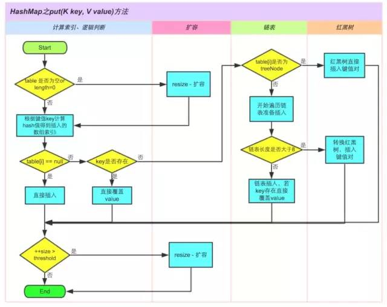
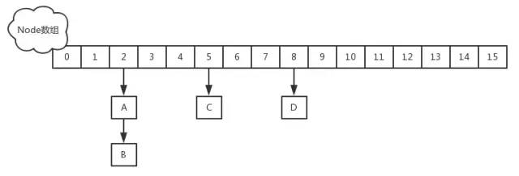

#### 1.Java集合框架的基础接口有哪些？
Collection为集合层级的根接口。一个集合代表一组对象，这些对象即为它的元素。Java平台不提供这个接口任何直接的实现。

Set是一个不能包含重复元素的集合。这个接口对数学集合抽象进行建模，被用来代表集合，就如一副牌。

List是一个有序集合，可以包含重复元素。你可以通过它的索引来访问任何元素。List更像长度动态变换的数组。

Map是一个将key映射到value的对象.一个Map不能包含重复的key：每个key最多只能映射一个value。

一些其它的接口有Queue、Dequeue、SortedSet、SortedMap和ListIterator。

#### 2.Iterater和ListIterator之间有什么区别？
（1）我们可以使用Iterator来遍历Set和List集合，而ListIterator只能遍历List。

（2）Iterator只可以向前遍历，而LIstIterator可以双向遍历。

（3）ListIterator从Iterator接口继承，然后添加了一些额外的功能，比如添加一个元素、替换一个元素、获取前面或后面元素的索引位置。

#### 3.遍历一个List有哪些不同的方式？
List<String> strList = new ArrayList<>();

for(String obj : strList){   System.out.println(obj); }

Iterator<String> it = strList.iterator(); 

while(it.hasNext()){   String obj = it.next();   System.out.println(obj); }

使用迭代器更加线程安全，因为它可以确保，在当前遍历的集合元素被更改的时候，它会抛出ConcurrentModificationException。

#### 4.在Java中，HashMap是如何工作的？
        HashMap在Map.Entry静态内部类实现中存储key-value对。HashMap使用哈希算法，在put和get方法中，它使用hashCode()和equals()方法。当我们通过传递key-value对调用put方法的时候，HashMap使用Key hashCode()和哈希算法来找出存储key-value对的索引。Entry存储在LinkedList中，所以如果存在entry，它使用equals()方法来检查传递的key是否已经存在，如果存在，它会覆盖value，如果不存在，它会创建一个新的entry然后保存。当我们通过传递key调用get方法时，它再次使用hashCode()来找到数组中的索引，然后使用equals()方法找出正确的Entry，然后返回它的值。下面的图片解释了详细内容。

        其它关于HashMap比较重要的问题是容量、负荷系数和阀值调整。HashMap默认的初始容量是32，负荷系数是0.75。阀值是为负荷系数乘以容量，无论何时我们尝试添加一个entry，如果map的大小比阀值大的时候，HashMap会对map的内容进行重新哈希，且使用更大的容量。容量总是2的幂，所以如果你知道你需要存储大量的key-value对，比如缓存从数据库里面拉取的数据，使用正确的容量和负荷系数对HashMap进行初始化是个不错的做法。

#### 5.hashCode()和equals()方法有何重要性？
        HashMap使用Key对象的hashCode()和equals()方法去决定key-value对的索引。当我们试着从HashMap中获取值的时候，这些方法也会被用到。如果这些方法没有被正确地实现，在这种情况下，两个不同Key也许会产生相同的hashCode()和equals()输出，HashMap将会认为它们是相同的，然后覆盖它们，而非把它们存储到不同的地方。同样的，所有不允许存储重复数据的集合类都使用hashCode()和equals()去查找重复，所以正确实现它们非常重要。equals()和hashCode()的实现应该遵循以下规则：

        （1）如果o1.equals(o2)，那么o1.hashCode() == o2.hashCode()总是为true的。

        （2）如果o1.hashCode() == o2.hashCode()，并不意味着o1.equals(o2)会为true。

#### 6.我们能否使用任何类作为Map的key？
我们可以使用任何类作为Map的key，然而在使用它们之前，需要考虑以下几点：

（1）如果类重写了equals()方法，它也应该重写hashCode()方法。

（2）类的所有实例需要遵循与equals()和hashCode()相关的规则。请参考之前提到的这些规则。

（3）如果一个类没有使用equals()，你不应该在hashCode()中使用它。

（4）用户自定义key类的最佳实践是使之为不可变的，这样，hashCode()值可以被缓存起来，拥有更好的性能。不可变的类也可以确保hashCode()和equals()在未来不会改变，这样就会解决与可变相关的问题了。

比如，我有一个类MyKey，在HashMap中使用它。

//传递给MyKey的name参数被用于equals()和hashCode()中 MyKey key = new MyKey('Pankaj'); //assume hashCode=1234 myHashMap.put(key, 'Value'); // 以下的代码会改变key的hashCode()和equals()值 key.setName('Amit'); //assume new hashCode=7890 //下面会返回null，因为HashMap会尝试查找存储同样索引的key，而key已被改变了，匹配失败，返回null myHashMap.get(new MyKey('Pankaj'));

那就是为何String和Integer被作为HashMap的key大量使用。

#### 7.HashMap和HashTable有何不同？
（1）HashMap允许key和value为null，而HashTable不允许。

（2）HashTable是同步的，而HashMap不是。所以HashMap适合单线程环境，HashTable适合多线程环境。

（3）在Java1.4中引入了LinkedHashMap，HashMap的一个子类，假如你想要遍历顺序，你很容易从HashMap转向LinkedHashMap，但是HashTable不是这样的，它的顺序是不可预知的。

（4）HashMap提供对key的Set进行遍历，因此它是fail-fast的，但HashTable提供对key的Enumeration进行遍历，它不支持fail-fast。

（5）HashTable被认为是个遗留的类，如果你寻求在迭代的时候修改Map，你应该使用CocurrentHashMap。

#### 8.ArrayList和Vector有何异同点？
ArrayList和Vector在很多时候都很类似。

（1）两者都是基于索引的，内部由一个数组支持。

（2）两者维护插入的顺序，我们可以根据插入顺序来获取元素。

（3）ArrayList和Vector的迭代器实现都是fail-fast的。

（4）ArrayList和Vector两者允许null值，也可以使用索引值对元素进行随机访问。

以下是ArrayList和Vector的不同点。

（1）Vector是同步的，而ArrayList不是。然而，如果你寻求在迭代的时候对列表进行改变，你应该使用CopyOnWriteArrayList。

（2）ArrayList比Vector快，它因为有同步，不会过载。

（3）ArrayList更加通用，因为我们可以使用Collections工具类轻易地获取同步列表和只读列表。

#### 9.Array和ArrayList有何区别？什么时候更适合用Array？
Array可以容纳基本类型和对象，而ArrayList只能容纳对象。

Array是指定大小的，而ArrayList大小是固定的。

Array没有提供ArrayList那么多功能，比如addAll、removeAll和iterator等。尽管ArrayList明显是更好的选择，但也有些时候Array比较好用。

（1）如果列表的大小已经指定，大部分情况下是存储和遍历它们。

（2）对于遍历基本数据类型，尽管Collections使用自动装箱来减轻编码任务，在指定大小的基本类型的列表上工作也会变得很慢。

（3）如果你要使用多维数组，使用[][]比List>更容易。

#### 10.ArrayList和LinkedList有何区别？
ArrayList和LinkedList两者都实现了List接口，但是它们之间有些不同。
  1. ArrayList 采用的底层是数组,连续的空间地址 而 LinkedList 底层采用的链表  存储上下一个元素的位置

（1）ArrayList是由Array所支持的基于一个索引的数据结构，所以它提供对元素的随机访问，复杂度为O(1)，但LinkedList存储一系列的节点数据，每个节点都与前一个和下一个节点相连接。所以，尽管有使用索引获取元素的方法，内部实现是从起始点开始遍历，遍历到索引的节点然后返回元素，时间复杂度为O(n)，比ArrayList要慢。

（2）与ArrayList相比，在LinkedList中插入、添加和删除一个元素会更快，因为在一个元素被插入到中间的时候，不会涉及改变数组的大小，或更新索引。

（3）LinkedList比ArrayList消耗更多的内存，因为LinkedList中的每个节点存储了前后节点的引用。（因为采用的链表 ）

#### 11.哪些集合类是线程安全的？
Vector、HashTable、Properties和Stack是同步类，所以它们是线程安全的，可以在多线程环境下使用。Java1.5并发API包括一些集合类，允许迭代时修改，因为它们都工作在集合的克隆上，所以它们在多线程环境中是安全的。

#### 12.Collections类是什么？
Java.util.Collections是一个工具类仅包含静态方法，它们操作或返回集合。它包含操作集合的多态算法，返回一个由指定集合支持的新集合和其它一些内容。这个类包含集合框架算法的方法，比如折半搜索、排序、混编和逆序等。

#### 13.Comparable和Comparator接口有何区别？
Comparable和Comparator接口被用来对对象集合或者数组进行排序。Comparable接口被用来提供对象的自然排序，我们可以使用它来提供基于单个逻辑的排序。

Comparator接口被用来提供不同的排序算法，我们可以选择需要使用的Comparator来对给定的对象集合进行排序。

#### 14.我们如何对一组对象进行排序？
如果我们需要对一个对象数组进行排序，我们可以使用Arrays.sort()方法。如果我们需要排序一个对象列表，我们可以使用Collection.sort()方法。两个类都有用于自然排序（使用Comparable）或基于标准的排序（使用Comparator）的重载方法sort()。Collections内部使用数组排序方法，所有它们两者都有相同的性能，只是Collections需要花时间将列表转换为数组。

高手过招
面试官见你应对自如，知道你也不是等闲之辈，于是眼神也变得专注起来，于是你们双双跃起，在空中展开厮斗，虽然面试官每一招都非常到位，但是你依然可以与之抗衡。

1、HashMap为什么不直接使用hashCode()处理后的哈希值直接作为table的下标？
HashMap自己实现了自己的hash()方法，通过两次扰动使得它自己的哈希值高低位自行进行异或运算，降低哈希碰撞概率也使得数据分布更平均；

在保证数组长度为2的幂次方的时候，使用hash()运算之后的值与运算（&）（数组长度 - 1）来获取数组下标的方式进行存储，这样一来是比取余操作更加有效率，二来也是因为只有当数组长度为2的幂次方时，h&(length-1)才等价于h%length，三来解决了“哈希值与数组大小范围不匹配”的问题；

2、为什么数组长度要保证为2的幂次方呢？
只有当数组长度为2的幂次方时，h&(length-1)才等价于h%length，即实现了key的定位，2的幂次方也可以减少冲突次数，提高HashMap的查询效率；

如果 length 为 2 的次幂 则 length-1 转化为二进制必定是 11111……的形式，在于 h 的二进制与操作效率会非常的快，而且空间不浪费；如果 length 不是 2 的次幂，比如 length 为 15，则 length - 1 为 14，对应的二进制为 1110，在于 h 与操作，最后一位都为 0 ，而 0001，0011，0101，1001，1011，0111，1101 这几个位置永远都不能存放元素了，空间浪费相当大，更糟的是这种情况中，数组可以使用的位置比数组长度小了很多，这意味着进一步增加了碰撞的几率，减慢了查询的效率！这样就会造成空间的浪费。

3、HashMap的put方法的具体流程？


4、ConcurrentHashMap的具体实现知道吗？


答：在JDK1.7中，ConcurrentHashMap采用Segment + HashEntry的方式进行实现，结构如下：


该类包含两个静态内部类 HashEntry 和 Segment ；前者用来封装映射表的键值对，后者用来充当锁的角色； Segment 是一种可重入的锁 ReentrantLock，每个 Segment 守护一个HashEntry 数组里得元素，当对 HashEntry 数组的数据进行修改时，必须首先获得对应的 Segment 锁。

在JDK1.8中，放弃了Segment臃肿的设计，取而代之的是采用Node + CAS + Synchronized来保证并发安全进行实现，结构如下：


插入元素过程（建议去看看源码）：

如果相应位置的Node还没有初始化，则调用CAS插入相应的数据；

        else if ((f = tabAt(tab, i = (n - 1) & hash)) == null) {

            if (casTabAt(tab, i, null, new Node<K,V>(hash, key, value, null)))

                break;                   // no lock when adding to empty bin

        }

如果相应位置的Node不为空，且当前该节点不处于移动状态，则对该节点加synchronized锁，如果该节点的hash不小于0，则遍历链表更新节点或插入新节点；
``` java 

if (fh >= 0) {

    binCount = 1;

    for (Node<K,V> e = f;; ++binCount) {

        K ek;

        if (e.hash == hash &&

            ((ek = e.key) == key ||

             (ek != null && key.equals(ek)))) {

            oldVal = e.val;

            if (!onlyIfAbsent)

                e.val = value;

            break;

        }

        Node<K,V> pred = e;

        if ((e = e.next) == null) {

            pred.next = new Node<K,V>(hash, key, value, null);

            break;

        }

    }

}```

如果该节点是TreeBin类型的节点，说明是红黑树结构，则通过putTreeVal方法往红黑树中插入节点；如果binCount不为0，说明put操作对数据产生了影响，如果当前链表的个数达到8个，则通过treeifyBin方法转化为红黑树，如果oldVal不为空，说明是一次更新操作，没有对元素个数产生影响，则直接返回旧值； 如果插入的是一个新节点，则执行addCount()方法尝试更新元素个数baseCount；

5、HashMap的扩容操作是怎么实现的？
答：通过分析源码我们知道了HashMap通过resize()方法进行扩容或者初始化的操作，下面是对源码进行的一些简单分析：

/**

 * 该函数有2中使用情况：1.初始化哈希表；2.当前数组容量过小，需要扩容

 */

``` java 
    final Node<K,V>[] resize() {

    Node<K,V>[] oldTab = table;// 扩容前的数组（当前数组）

    int oldCap = (oldTab == null) ? 0 : oldTab.length;// 扩容前的数组容量（数组长度）

    int oldThr = threshold;// 扩容前数组的阈值

    int newCap, newThr = 0;

    if (oldCap > 0) {

        // 针对情况2：若扩容前的数组容量超过最大值，则不再扩容

        if (oldCap >= MAXIMUM_CAPACITY) {

            threshold = Integer.MAX_VALUE;

            return oldTab;

        }

        // 针对情况2：若没有超过最大值，就扩容为原来的2倍（左移1位）

        else if ((newCap = oldCap << 1) < MAXIMUM_CAPACITY &&

                oldCap >= DEFAULT_INITIAL_CAPACITY)

            newThr = oldThr << 1; // double threshold

    }

    // 针对情况1：初始化哈希表（采用指定或者使用默认值的方式）

    else if (oldThr > 0) // initial capacity was placed in threshold

        newCap = oldThr;

    else {               // zero initial threshold signifies using defaults

        newCap = DEFAULT_INITIAL_CAPACITY;

        newThr = (int)(DEFAULT_LOAD_FACTOR * DEFAULT_INITIAL_CAPACITY);

    }

    // 计算新的resize上限

    if (newThr == 0) {

        float ft = (float)newCap * loadFactor;

        newThr = (newCap < MAXIMUM_CAPACITY && ft < (float)MAXIMUM_CAPACITY ?

                (int)ft : Integer.MAX_VALUE);

    }

    threshold = newThr;

    @SuppressWarnings({"rawtypes","unchecked"})

    Node<K,V>[] newTab = (Node<K,V>[])new Node[newCap];

    table = newTab;

    if (oldTab != null) {

        // 把每一个bucket都移动到新的bucket中去

        for (int j = 0; j < oldCap; ++j) {

            Node<K,V> e;

            if ((e = oldTab[j]) != null) {

                oldTab[j] = null;

                if (e.next == null)

                    newTab[e.hash & (newCap - 1)] = e;

                else if (e instanceof TreeNode)

                    ((TreeNode<K,V>)e).split(this, newTab, j, oldCap);

                else { // preserve order

                    Node<K,V> loHead = null, loTail = null;

                    Node<K,V> hiHead = null, hiTail = null;

                    Node<K,V> next;

                    do {

                        next = e.next;

                        if ((e.hash & oldCap) == 0) {

                            if (loTail == null)

                                loHead = e;

                            else

                                loTail.next = e;

                            loTail = e;

                        }

                        else {

                            if (hiTail == null)

                                hiHead = e;

                            else

                                hiTail.next = e;

                            hiTail = e;

                        }```

                    